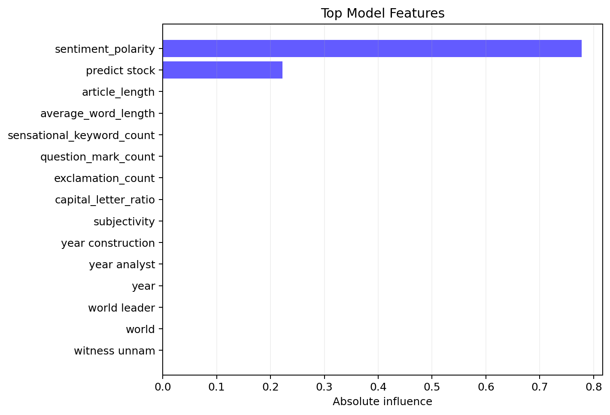

# VerityAI - Fake News Detection Platform

VerityAI is a production-style machine learning application that screens news articles for language patterns associated with misinformation. It combines TF-IDF text representation, sentiment analysis, engineered writing-style signals, automated model comparison, explainable predictions, and a responsive Flask dashboard.

The project is designed for final-year evaluation, portfolio demonstrations, internships, and technical interviews.



## Highlights

- End-to-end Scikit-Learn pipeline for preprocessing, feature engineering, and classification
- Automatic comparison of Logistic Regression, Random Forest, Decision Tree, Linear SVM, and Naive Bayes
- Optional XGBoost participation when the package is installed
- Model selection ranked by F1, accuracy, precision, and recall
- Sentiment polarity, subjectivity, capitalization, punctuation, article length, readability, and sensational-language signals
- Local feature-contribution explanations for individual predictions
- Animated fake-news probability and confidence meters
- Model analytics with Chart.js, confusion matrix, ROC curve, and feature importance
- Searchable, sortable, paginated dataset explorer
- Secure CSV validation, upload, retraining, model caching, logging, and usage statistics
- Downloadable JSON metrics, PNG charts, and PDF training report
- Responsive Bootstrap 5 interface with dark mode and mobile navigation

## Current Demo Performance

The bundled dataset is intentionally small and exists only to make the project runnable immediately.

| Metric | Value |
|---|---:|
| Selected model | Decision Tree |
| Accuracy | 75.00% |
| Precision | 100.00% |
| Recall | 50.00% |
| F1 score | 66.67% |
| Dataset size | 24 articles |

These results are generated from a stratified holdout set. For meaningful real-world performance, import a substantially larger Kaggle dataset through the application.

## Architecture

```text
Browser
  |
  v
Flask Routes and JSON API
  |
  +--> PredictionEngine ----> Cached Scikit-Learn Pipeline
  |                              |
  |                              +--> NLP Preprocessor
  |                              +--> TF-IDF Vectorizer
  |                              +--> Language Feature Engineer
  |                              +--> Selected Classifier
  |
  +--> ModelTrainer ---------> Model Comparison and Evaluation
  |                              |
  |                              +--> Metrics JSON
  |                              +--> Confusion Matrix
  |                              +--> ROC Curve
  |                              +--> Feature Importance
  |                              +--> PDF Training Report
  |
  +--> DatasetService -------> CSV Validation and Normalization
```

## Project Structure

```text
fake-news-detection/
├── app.py
├── config.py
├── requirements.txt
├── data/
│   ├── raw/
│   ├── processed/
│   └── sample_news.csv
├── models/
│   ├── model.pkl
│   ├── vectorizer.pkl
│   └── metrics.json
├── services/
│   ├── preprocessing.py
│   ├── feature_engineering.py
│   ├── training.py
│   ├── prediction.py
│   └── sentiment.py
├── static/
│   ├── css/app.css
│   ├── js/
│   ├── images/
│   └── icons/
├── templates/
│   ├── base.html
│   ├── index.html
│   ├── dashboard.html
│   ├── upload.html
│   └── reports.html
├── reports/
│   ├── confusion_matrix.png
│   ├── feature_importance.png
│   ├── roc_curve.png
│   └── training_report.pdf
└── tests/
```

## Installation

Python 3.11 or 3.12 is recommended.

```powershell
py -3.12 -m venv .venv
.venv\Scripts\activate
python -m pip install -r requirements.txt
```

The existing workspace already contains a configured Python 3.12 virtual environment.

## Run

```powershell
.venv\Scripts\python.exe app.py
```

Open [http://127.0.0.1:8000](http://127.0.0.1:8000).

On first launch, the app trains and caches a model automatically if no model artifact exists.

## Dataset Format

The CSV must contain:

- A label column named `label`, `target`, `class`, or `type`
- At least one text column named `text`, `content`, `article`, `statement`, or `body`
- An optional `title` column

Accepted labels:

- Real: `real`, `true`, `0`, `reliable`, `genuine`
- Fake: `fake`, `false`, `1`, `unreliable`, `fabricated`

Example:

```csv
title,text,label
"City opens new clinic","The health department confirmed the opening date...",real
"Secret cure hidden by doctors","A viral post claims an overnight miracle...",fake
```

Uploaded files are limited to 10 MB and validated for schema, minimum row count, duplicates, empty articles, supported labels, and class availability.

## ML Pipeline

```text
Input
-> HTML and URL removal
-> Tokenization
-> Stop-word removal
-> Lightweight stemming
-> TF-IDF unigrams and bigrams
-> Numeric language features
-> Classifier
-> Probability and local explanation
```

Numeric features:

- Sentiment polarity
- Subjectivity
- Capital letter ratio
- Exclamation count
- Question mark count
- Sensational keyword count
- Average word length
- Article length

## Reports

Training produces:

- `models/metrics.json`
- `reports/confusion_matrix.png`
- `reports/roc_curve.png`
- `reports/feature_importance.png`
- `reports/training_report.pdf`

All artifacts are available from the Reports page.

## Tests

```powershell
.venv\Scripts\python.exe -m unittest discover -s tests -v
```

## Security and Reliability

- Filename sanitization and extension validation
- Upload size enforcement
- Server-side schema and label validation
- Input sanitization and maximum article length
- Centralized exception handling
- Rotating application logs
- Security response headers
- Thread-safe lazy model caching and usage statistics

## Future Enhancements

- Train on a full-scale LIAR, FakeNewsNet, or Kaggle corpus
- Add source reputation and claim-evidence retrieval
- Introduce transformer embeddings and ensemble calibration
- Track model versions and dataset lineage
- Add authenticated workspaces and persistent prediction history
- Package with Docker and a production WSGI server

## Responsible Use

VerityAI evaluates linguistic patterns. It does not independently verify facts or replace professional fact-checking. Predictions should be treated as decision support and reviewed against credible primary sources.
